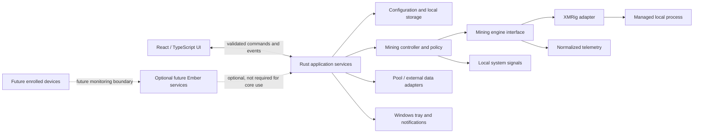

# Ember High-Level Architecture

**Status:** Conceptual target and implementation facts, recorded 2026-09-29. The M00C foundation establishes the root layout, a minimal Rust-owned shell status, and initial Windows tray/window behavior; it does not establish a mining architecture implementation.

## Platform and responsibilities

The planned stack is Tauri 2, Rust, React, and TypeScript, initially Windows-first.

- **React/TypeScript frontend:** onboarding, dashboard, settings, tray-related user surfaces, presentation of status and estimates, and user actions. It should not own process-control or privileged operating-system logic.
- **Rust/Tauri backend:** operating-system integration, configuration and persistence access, mining-engine lifecycle, telemetry acquisition, policy enforcement at local boundaries, and narrowly scoped commands/events exposed to the frontend.
- **Tauri boundary:** define explicit command and event contracts. Validate inputs at the backend boundary; do not treat UI validation as a security boundary. Keep permissions and exposed capabilities narrow.

The initial Tauri capability grants only `core:default`. Reassess permissions as native features are added. Broader IPC schemas, module boundaries, and future capability needs remain pending design.

The initial repository root contains the React/Vite frontend in `src/` and the Tauri/Rust application in `src-tauri/`. The first lockfile resolves Tauri API/CLI/crate 2.12.0, React 19.3.0, TypeScript 6.0.3, and Vite 6.4.3. Vite 6 was selected to work with the available Node 20.13 development environment. The only frontend-to-Rust command is `shell_status`, which reports `notConfigured`; Rust remains authoritative and no miner is integrated. Historical code is separated under `legacy/`.

## Conceptual components

This diagram describes responsibilities, not a settled deployment or code layout.

## Local-first boundary

The initial core should operate locally: application configuration, mining control, local statistics, and Smart Mining should not require accounts or cloud connectivity. External pool or market data may require network access for selected features; failures should not silently change mining consent or control behavior.

Future Ember services may support optional accounts, synchronization, community features, or multi-device monitoring. They must remain separate from the basic local mining path. Remote-device enrollment and control are out of scope now.

## Mining engine boundary

The application should depend on a conceptual mining-engine interface rather than XMRig-specific UI behavior. The boundary is expected to cover capability/version information, configuration, availability/validation, start/stop, lifecycle status, health, and normalized telemetry. XMRig would initially be implemented as an adapter. This is not a proposal for a plugin framework; additional engines and assets are future possibilities.

### Process lifecycle responsibilities

The future controller/adapter needs explicit handling for locating or provisioning a binary, validating configuration, launching with controlled arguments/environment, confirming startup, tracking unexpected exits, requesting graceful stop, timeout/escalation behavior, process-tree cleanup, and shutdown/restart behavior. It also needs version and health reporting, bounded logging, and a documented update path.

Prefer a supported structured local API for telemetry/control when appropriate and safe. Define access controls, loopback binding, authentication/secrets, and failure behavior before enabling an API. Console parsing may be a compatibility/fallback mechanism, not the sole assumed contract. No XMRig integration is implemented in this milestone.

## Miner acquisition and integrity

Three strategies remain open: bundle XMRig, download a verified official release, or ask users to supply an existing installation. Ember’s preferred eventual usability direction is managed acquisition/configuration if legally and technically appropriate, but no decision is made before authoritative licensing and security research.

Any future downloaded or bundled executable requires a documented provenance and integrity strategy, including release source, signature/hash verification, version pinning/update policy, failure behavior, and user-visible status. Research current XMRig licensing and redistribution obligations before selecting a strategy.

## Smart Mining and system signals

Keep profile/policy decisions in a controller boundary distinct from UI presentation and engine-specific controls. Inputs may eventually include user limits, system activity, battery state, workload/game signals, and temperature where dependable. The controller should expose current constraints and a user-readable reason for changes. Signal quality, precedence, overrides, thermal support, and safety behavior remain unresolved.

## Configuration and persistence

Use deliberate structured local storage, not ad hoc generated files or launcher scripts. Likely categories:

- preferences and notification settings;
- public wallet/pool/mining configuration;
- Smart Mining profiles and schedules;
- local mining events/statistics and history;
- cached external data;
- future device identity metadata.

SQLite is a candidate for historical/statistical data, not a decision. Public wallet addresses are not private keys, but remain user-specific and privacy-sensitive. Any future credentials/secrets require appropriate OS-backed secure storage rather than ordinary configuration. Define export, retention, and deletion behavior before accumulating history.

## Pool and external-service adapters

Pool/provider APIs and market/exchange data should be accessed through narrow adapters that normalize units, timestamps, and missing/stale/error states. Keep provider-specific schemas out of UI components. Reliability, rate limits, supported providers, caching, and calculation assumptions require later research and decisions. Ember must not depend on an Ember-owned pool.

Earnings, fiat value, power, and net-result views must identify estimates and their inputs. Distinguish direct measurements from estimates and stale external data.

## Tray and application lifecycle

The foundation implements a Windows tray with **Open Ember** and **Quit Ember** actions. Open shows, unminimizes, and focuses the existing main window. Closing the window hides it; it does not quit the application. Quit exits the application. The tray uses the temporary Ember mark and shows no mining telemetry. The production content security policy allows only local assets and Tauri IPC; the development policy additionally permits the local Vite server. This is the initial shell decision, not a final policy for future active mining: later work must decide whether quit prompts/stops a miner and how state remains visible. Autostart remains out of scope and must be opt-in if added.

## Diagnostics and logging

Use bounded, user-controllable diagnostics. Avoid logging wallet addresses, credentials, private paths, or unnecessary usage details. Define redaction, retention, export, and deletion before production logging. Miner output should not be forwarded wholesale to the frontend or persisted by default; handle it as untrusted input and parse into bounded, normalized events.

## Future boundaries

- **Cloud:** optional services for accounts/sync/community must not be a dependency for local mining.
- **Multi-device:** start with explicit enrollment and monitoring. Remote control, if ever pursued, requires device identity, authentication/authorization, encrypted transport, revocation, auditability, offline handling, and safe command boundaries.
- **Additional engines/assets:** add through the engine/domain boundary after requirements and support are established; do not bind all application concepts to XMRig or Monero.

## Pending architecture decisions

1. XMRig acquisition strategy, release source, licensing obligations, and verification mechanism.
2. XMRig API/control configuration, authentication, binding, and telemetry contract.
3. Shutdown semantics, process-tree management, timeout escalation, and crash recovery.
4. Whether/when admin rights are ever needed; default is least privilege.
5. Local database choice, schema ownership, migration, retention, export, and deletion.
6. Supported pool/market data sources and estimate methodology.
7. Smart Mining signals, limits, precedence, overrides, and laptop/thermal behavior.
8. Behavior of Quit while future mining is active and any opt-in autostart mechanism.
9. Contribution implementation and auditable accounting.

See [Security](SECURITY.md) for trust constraints and [Decisions](DECISIONS.md) for the decision log.
