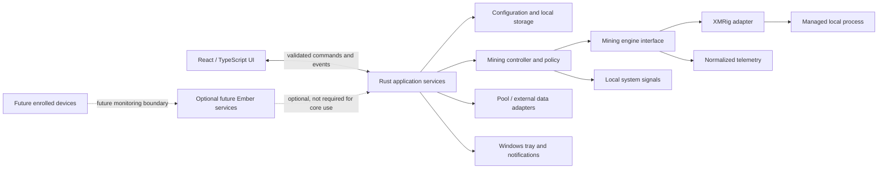

# Ember High-Level Architecture

**Status:** Conceptual target and implementation facts, updated 2026-10-07. M03's functional foundation includes a controlled-session launch path for verified XMRig v6.26.0 Windows x64. The owner has verified a stable native Starting → Mining session, authenticated API telemetry, a connected pool, real hashrate and the compact live UI. Stop/Quit owner acceptance remains open. The earlier API startup failure is no longer reproducing. See [Roadmap](ROADMAP.md) for release-hardening items.

## Platform and responsibilities

The planned stack is Tauri 2, Rust, React, and TypeScript, initially Windows-first.

- **React/TypeScript frontend:** onboarding, dashboard, settings, tray-related user surfaces, presentation of status and estimates, and user actions. It should not own process-control or privileged operating-system logic.
- **Rust/Tauri backend:** operating-system integration, configuration and persistence access, mining-engine lifecycle, telemetry acquisition, policy enforcement at local boundaries, and narrowly scoped commands/events exposed to the frontend.
- **Tauri boundary:** define explicit command and event contracts. Validate inputs at the backend boundary; do not treat UI validation as a security boundary. Keep permissions and exposed capabilities narrow.

The initial Tauri capability grants only `core:default`. Reassess permissions as native features are added. Broader IPC schemas, module boundaries, and future capability needs remain pending design.

The repository root contains the React/Vite frontend in `src/` and the Tauri/Rust application in `src-tauri/`. Rust owns system observations, setup/consent, config, diagnostics, process supervision, runtime storage, and the XMRig API contract. Mining controls and controlled native launch are implemented and have passed a real owner-machine session. Historical code is under `legacy/`.

The controlled Windows launch uses `CREATE_NO_WINDOW` with `CREATE_SUSPENDED`, explicit redirected standard handles, and Job Object assignment before resume. Rust publishes truthful startup stages and bounded monotonic stage timings; the frontend presents those values and never runs its own startup timer. XMRig's summary algorithm list does not prove RandomX has initialized, so the UI stays at `Waiting for miner…` until positive short-window hashrate supports the `Mining` state. Windows security-product failures are reported without guessing which product acted; Ember offers its ordinary verified retry/check/repair paths and does not alter security settings.

### Local system observation (M02)

`src-tauri/src/system_observation.rs` owns a single `sysinfo::System` instance managed by Tauri. The `system_snapshot` command returns nullable, serializable fields for CPU model/logical processor count/overall usage, physical memory, hostname, OS version, uptime, power source/battery percentage, and session input idle duration. `sysinfo` refreshes only CPU and RAM; it does not enumerate processes. Windows power and idle details use `GetSystemPowerStatus` and `GetLastInputInfo` plus `GetTickCount` through `windows-sys`. Failed or unsupported queries remain unknown/null independently.

The visible shell requests one snapshot every five seconds, waits for each request before scheduling the next, and pauses while the WebView document is hidden. CPU utilization uses the native library’s inter-sample calculation; until a valid second sample exists, its value is null. The current Active/Idle label is a presentation hint using a five-minute threshold; the raw session idle duration is preserved. `GetLastInputInfo` is session-specific, and Ember does not collect input content. All data remains in memory and on-device; it is not persisted or transmitted. These observations are not Smart Mining decisions and do not change resource use. Temperature, fan speed, CPU package power, and GPU telemetry are deferred because there is no generic reliable low-privilege source across Windows hardware.

## Conceptual components

This diagram describes responsibilities, not a settled deployment or code layout.

## Planned conceptual domains

These are ownership boundaries for roadmap planning, not a prescribed module/class layout. Keep domain facts distinct rather than building one state object that mixes engine truth, estimates, progression, UI and cloud state.

- **Mining Engine:** verified engine identity, configuration translation, process lifecycle and engine-specific integration.
- **Engine Telemetry:** normalized measured engine values with sample time and explicit unavailable/error states.
- **Pool/Economic Telemetry:** pool-reported accounting and external market data, plus clearly identified estimates.
- **Smart Mining Policy:** consumes approved local signals and user settings, chooses policy actions and supplies a human-readable reason. It never removes Stop/Quit control.
- **Ember Stream/Event Model:** translates genuine observable events into bounded, sanitized, timestamped product events; raw XMRig output remains a separate advanced diagnostic.
- **Activity/History:** retained local events/statistics under explicit retention, export and deletion rules.
- **Progression:** derives application milestones from verified activity; XP/levels are not financial value or mining output.
- **Contribution:** owns an explicitly approved, disclosed and auditable model, separate from engine upstream donation.
- **Optional Remote Machine:** a later boundary requiring explicit enrollment and revocation; it cannot be a hidden extension of the local supervisor.

### Telemetry provenance

Every user-facing metric has a known source. **Engine measured** includes hashrate, process uptime and backend state; XMRig-relayed pool submission results remain engine telemetry. **Pool reported** includes balance, payouts and pool-side hashrate where an authoritative provider supplies them. **Ember observed** includes Smart Mining time, application state, idle state and profile changes. **Estimated** includes fiat value, projected earnings, electricity when hardware power is not directly measured, and net result. Preserve unavailable distinctly from numeric zero. Do not style or label estimates as measured facts; provenance can be concise on the primary surface and explained in details.

## Local-first boundary

The initial core should operate locally: application configuration, mining control, local statistics, and Smart Mining should not require accounts or cloud connectivity. External pool or market data may require network access for selected features; failures should not silently change mining consent or control behavior.

Future Ember services may support optional accounts, synchronization, community features, or multi-device monitoring. They must remain separate from the basic local mining path. Remote-device enrollment and control are out of scope now.

## Mining engine boundary

Rust owns one internal `MiningEngine` boundary rather than XMRig-specific UI behavior. It covers availability/version, validation, start/stop, lifecycle status, normalized telemetry, and bounded diagnostics. XMRig is the initial adapter; this is not a plugin framework. The UI renders Rust-owned lifecycle state and cannot bypass the consent-checked backend path. M03C.2B connects the pinned summary parser, authenticated loopback client, private runtime session, verified artifact and suspended Job Object launch, readiness gate, telemetry monitor, stop/quit cleanup and active-session views. The M04A parser normalizes XMRig summary result counters and current pool connection facts as well as hashrate and CPU huge-page counts. See [XMRig Integration](XMRIG_INTEGRATION.md) for exact source semantics and limitations.

### M04A telemetry contract

`MiningTelemetry` is an engine snapshot: version, XMRig API uptime, pause flag, enabled algorithms, three H/s windows, optional result counters/current difficulty, optional pool connection state/endpoint/uptime/failure/ping/TLS/job facts, optional CPU huge-page allocation and sample time. Rust `Option` preserves missing/null distinctly from reported zero. XMRig-reported share counters represent pool submission responses, not direct account telemetry. Ember lifecycle/process ownership, monotonic session duration and selected profile remain separate observed facts. The snapshot carries no earnings, progression, contribution, cloud or UI animation state.

Hashrate windows mean 10s/60s/15m rolling rates. Use the 10-second value as beginner-facing **Current hashrate**, with its window clarified in Details. Lifecycle does not imply a connected pool, available job, nonzero rate at each sample, or accepted shares. Process existence, API health/freshness, backend state, pool connection and hashing are separate facts. See the [complete source audit](XMRIG_INTEGRATION.md#m04a-normalized-summary-contract).

The local monitor uses one serial poller with a two-second deadline and one-second loop delay. The last good sample is Fresh for five seconds, then Stale while retained; no sample or a cleaned-up session is Unavailable. Poll failures do not change lifecycle; process exit remains supervisor-owned. Continue local sampling while hidden, poll more slowly when paused, and never poll after stop. Pause/Resume has no established control mechanism compatible with restricted read-only API access; M04C must not relax that boundary.

M04B exposes the normalized snapshot and freshness enum only through the existing `mining_status` command. The frontend polls that Rust-owned snapshot serially with a one-second delay; it never contacts XMRig. Rust separately reports monotonic session duration. Profile and configured thread count come from the validated Ember setup. The UI preserves last-known values when stale, displays missing values as unavailable, and keeps lifecycle independent from pool state. It labels a positive hashrate as observed hashing but does not claim configured/listed threads are active workers. M04D keeps Overview to a short rate/pool/profile/time snapshot and gives Mining one operational composition for state, rate, pool, configured CPU capacity, duration, work results and Stop. Rolling windows, backend limits and provenance remain under keyboard-accessible Details. The Ember Core style reflects known state; it does not create telemetry or share events. M05B adds a compact Stream below Mining operations, reading only the `mining_events` command and showing recent event wording, category, severity and supplied timestamp. No chart or persistent event history is built. On desktop, the navigation sidebar and main workspace scroll independently; each remains scrollable for short viewports and zoom.

### M05A event model

`mining::events::EventLog` lives with the supervisor and owns transition translation plus a 256-entry FIFO buffer for the current Ember process. Event IDs combine the opaque random runtime-session ID and monotonic per-process sequence; timestamps are UTC Unix milliseconds. Starting/Mining/Stopped/Failed come from supervisor lifecycle transitions. The first authenticated Mining sample seeds pool and result-counter baselines, then later samples may yield pool state changes and aggregated accepted/rejected deltas. Missing/unknown values do not manufacture transitions; counter decreases rebaseline without negative events. Hashrate remains state. Events are retrieved through the `mining_events` Tauri command; frontend reads cannot create them.

The event vocabulary is structured (`EventKind`, category, severity and source), not a collection of display strings. Current categories are System, Pool and Result. Pool endpoint, wallet, worker credentials, API token, runtime path, config and raw output are excluded from event payloads. XMRig's normalized summary exposes counters and pool connection facts but no verified discrete job identity, so WORK events are deferred. Persistent Activity/history and retention, notifications, Smart Mining, economics, progression and contribution remain future consumers/sources.

Keep system, engine, pool results relayed through XMRig, pool/economic, progression and presentation state in their owning domains. Do not derive account/economic claims from local system or engine readings. Follow the provenance model above and [Product principles](PRODUCT.md).

### Process lifecycle responsibilities

M03B adds deterministic config validation, a verified-artifact gate, fixture-injected readiness, unexpected-exit handling, bounded diagnostics and stop escalation. On Windows, `process.rs` creates the Job Object first, creates the child suspended with redirected stdio, assigns the process handle to the kill-on-close job, and resumes its primary thread only after assignment succeeds. Any failure before resume terminates/reaps the suspended process; RAII-owned handles close on every path. When the direct child exits, the supervisor closes the Job Object before joining pipe readers so remaining descendants cannot keep redirected pipes open. Job assignment failure, including unsupported nested-job constraints, fails closed. M03C.2B uses this path for XMRig after immediate artifact and consent re-verification.

Prefer structured XMRig local API telemetry; stdout/stderr are bounded diagnostics only. Bind API to loopback and use a per-run secret. `ReqwestLocalApiTransport` uses a fixed loopback URL, verified Bearer authorization, no proxy, no redirects, bounded body and strict deadlines. Restricted mode permits only the authenticated GET summary request; Stop uses a bounded wait and then the owned Job Object rather than a control API route.

The future Ember policy/contribution layer owns the explicitly approved Contribution and accounting; neither the UI nor process adapter contains contribution logic. The working baseline is 5%, pending final decision; a higher rate is open. XMRig's built-in 1% donation is separate and must be represented honestly.

## Miner acquisition and integrity

M03A prefers an Ember-managed, explicitly user-approved download of an unmodified official XMRig release, subject to legal review. M03C.1 provisions v6.26.0 Windows x64 (`xmrig-6.26.0-windows-x64.zip`). Its fingerprint `9AC4 CEA8 E66E 35A5 C7CD DC1B 446A 5363 8BE9 4409` was independently confirmed from xmrig.com and the byte-identical official repository key. Rust verifies the detached signature and signed archive hash, extracts into a bounded staging directory, atomically promotes, and stores provenance/integrity metadata under per-user local app data. A controlled installation succeeded. The pre-spawn path re-verifies the installation immediately before execution. Legal/distribution review remains open; see [XMRig Integration](XMRIG_INTEGRATION.md).

Any future downloaded or bundled executable requires a documented provenance and integrity strategy, including release source, signature/hash verification, version pinning/update policy, failure behavior, and user-visible status. Research current XMRig licensing and redistribution obligations before selecting a strategy.

## Smart Mining and system signals

Keep profile/policy decisions in a controller boundary distinct from UI presentation and engine-specific controls. Inputs may eventually include user limits, system activity, battery state, workload/game signals, and temperature where dependable. The controller should expose current constraints and a user-readable reason for changes. Signal quality, precedence, overrides, thermal support, and safety behavior remain unresolved.

## Configuration and persistence

Use deliberate structured local storage, not ad hoc generated files or launcher scripts. Likely categories:

- preferences and notification settings;
- public wallet/pool/mining configuration;
- Smart Mining profiles and schedules;
- local mining events/statistics and history;
- cached external data;
- future device identity metadata.

SQLite is a candidate for historical/statistical data, not a decision. Public wallet addresses are not private keys, but remain user-specific and privacy-sensitive. Any future credentials/secrets require appropriate OS-backed secure storage rather than ordinary configuration. Define export, retention, and deletion behavior before accumulating history.

## Pool and external-service adapters

Pool/provider APIs and market/exchange data should be accessed through narrow adapters that normalize units, timestamps, and missing/stale/error states. Keep provider-specific schemas out of UI components. Reliability, rate limits, supported providers, caching, and calculation assumptions require later research and decisions. Ember must not depend on an Ember-owned pool.

Earnings, fiat value, power, and net-result views must identify estimates and their inputs. Distinguish direct measurements from estimates and stale external data.

## Tray and application lifecycle

The Windows tray provides **Open Ember** and **Quit Ember**, plus a disabled **Not mining** state item and the tooltip **Ember — Not mining**. Open shows, unminimizes, and focuses the existing main window. Closing the window hides it; it does not quit the application. Quit exits the application. The tray shows no telemetry. The production content security policy allows only local assets and Tauri IPC; the development policy additionally permits the local Vite server. This is the initial shell decision, not a final policy for future active mining: later work must decide whether quit prompts/stops a miner and how state remains visible. Autostart remains out of scope and must be opt-in if added.

## Diagnostics and logging

Use bounded, user-controllable diagnostics. Avoid logging wallet addresses, credentials, private paths, or unnecessary usage details. Define redaction, retention, export, and deletion before production logging. Miner output should not be forwarded wholesale to the frontend or persisted by default; handle it as untrusted input and parse into bounded, normalized events.

## Future boundaries

- **Cloud:** optional services for accounts/sync/community must not be a dependency for local mining.
- **Multi-device:** start with explicit enrollment and monitoring. Remote control, if ever pursued, requires device identity, authentication/authorization, encrypted transport, revocation, auditability, offline handling, and safe command boundaries.
- **Additional engines/assets:** add through the engine/domain boundary after requirements and support are established; do not bind all application concepts to XMRig or Monero.

## Pending architecture decisions

`mining::readiness::SetupService` owns normalized setup, consent revision and fresh validated candidates. `start_mining` rechecks setup and consent, verifies the pinned install immediately before the suspended-create/Job Object spawn, and holds a private ACL-protected runtime config for the process lifetime. The supervisor gates Mining on authenticated version/kind/restricted/paused/algorithm/positive-rate summary fields. A monitor refreshes normalized telemetry and reaps unexpected exits; `stop_mining`, tray Stop and tray Quit terminate only the owned process tree and clean its runtime session. Frontend inputs remain narrow and never include paths, argv, tokens or raw JSON. Overview, sidebar and Mining view consume state and telemetry IPC.

Schema 1 lives in `%LOCALAPPDATA%\Ember\setup-v1.json` with a revision and disclosure-version acknowledgement. No-config migrates to empty state; unsupported/corrupt files block setup and require explicit reset. Edits revoke acknowledgement; atomic same-directory replacement preserves the old config on write failure. Ephemeral API token and port remain Rust-owned; the generated JSON is stored only in a private per-session runtime directory and removed at session end or next startup after a crash.

1. Legal approval of XMRig GPLv3 acquisition/aggregation, notices and source obligations, including dependency notices.
2. Key-rotation/revocation response for future signing-key changes.
3. XMRig v6.26.0 `/2/summary` includes engine-relayed share counters and current connection fields; direct pool account balances/payouts remain unavailable without a provider.
4. Native Start → Mining and live API telemetry have passed on the owner's current release. Stop/Quit acceptance remains open for the checklist in [XMRig integration](XMRIG_INTEGRATION.md). Runtime cleanup remains bounded to Ember's owned Job Object.
5. Local database choice, schema ownership, migration, retention, export, and deletion.
6. Supported pool/market data sources and estimate methodology.
7. Smart Mining signals, limits, precedence, overrides, and laptop/thermal behavior.
8. Any opt-in autostart mechanism remains a separate future decision; current launch is user initiated only.
9. Contribution implementation and auditable accounting.

See [Security](SECURITY.md) for trust constraints and [Decisions](DECISIONS.md) for the decision log.
